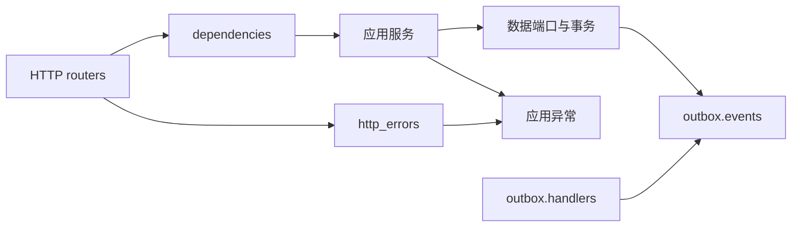

# 应用服务与 HTTP 边界

AUD-13 将业务调用、依赖装配和响应转换分开，保留现有路由及 JSON 契约。

| 位置 | 职责 |
| --- | --- |
| `app.services.*` | 显式接收 data store、cognition、analysis 等端口并执行用例；不导入 FastAPI、HTTP 装配或 Outbox handler |
| `app.review.service` | 审核状态机和写回前置校验；将冲突/不可处理原因转为应用异常 |
| `app.errors` | 不带 HTTP 状态或依赖装配的应用异常，保留文字或结构化错误证据 |
| `app.dependencies` | FastAPI `Depends` 工厂，组装正文、编译、参考、写回、模型和雪花服务及 workflow |
| `app.http_errors` | 唯一应用异常到 HTTP 的状态映射，由 main 安装处理器；路由需要附加响应头时使用同一转换函数 |
| `app.analysis.http` | 分析响应头；旧 `get_analysis_service` 入口集中 re-export 新工厂 |
| `app.outbox.events` | 无数据/执行装配依赖的 JSON payload 纯工厂 |
| `app.outbox.handlers` | 执行时端口与作业处理；旧 payload 名称 re-export 同一工厂 |

HTTP 状态保持为 404（记录缺失）、409（状态/版本冲突）、422（操作不合法或一致性阻断）、501（模型未配置）、502（模型执行失败）。结构化 `detail.consistency_report` 原样返回。旧接受接口的失败响应仍带 `Deprecation` 和 `Link`；这项兼容性有直接路由回归。

CLI/Outbox 调用服务时捕获应用异常，HTTP 调用由 handler 转换。不再把 `Depends` 对象作为服务构造参数的默认值；测试或 CLI 必须显式传入实际端口。服务模块中的旧 HTTP 工厂 import 已迁至 `app.dependencies`；router 的已有 workflow 入口和 analysis/payload 兼容入口仍指向唯一实现。

验证包括独立进程导入（确认核心服务不会加载 FastAPI/HTTP/handler）、直接服务错误、真实路由与依赖覆盖、结构化一致性错误和旧接口响应头、Provider 配置/执行错误区别、事件兼容导出身份，以及原有后端全套数据/API/Outbox/故障隔离回归。未改数据库、备份格式或生成业务规则。
