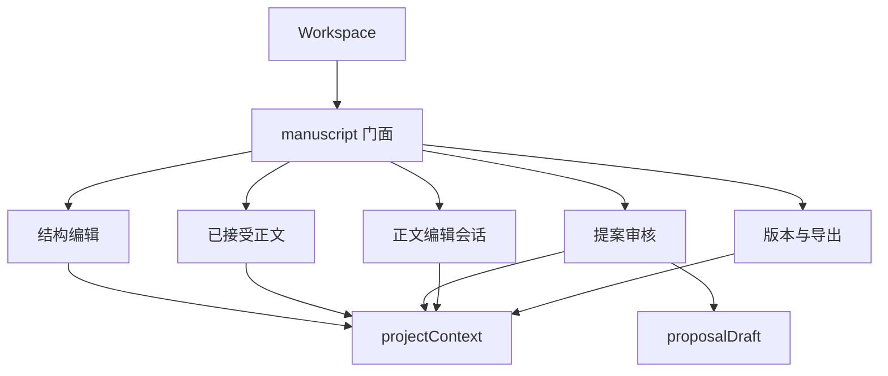

# 正文状态与依赖边界

AUD-12 第一阶段：`useManuscriptStore` 是兼容门面和装配入口。组件继续使用原来的属性、动作与 `storeToRefs`；内部模块是同一 Pinia effect scope 中只创建一次的组合函数，不另建 store 或镜像状态。

| 模块 | 独占状态及职责 | 必要依赖 |
| --- | --- | --- |
| `manuscript/structure.ts` | 章节、场景契约、选择、表单、保存标志、选择 epoch、离开保护、编译结果 | 项目 context 提供当前项目；draftSessions 管理缓存；Graph 在结构写入后刷新 |
| `manuscript/acceptedScenes.ts` | 已接受正文集合及加载 | 项目 context；统一消息区 |
| `manuscript/proposals.ts` | 提案集合/选择、生成/审核状态、一致性检查结果 | 只读场景选择；proposalDraft 独占待审正文草稿；加载正文回调用于冲突；提交后刷新回调 |
| `manuscript/editing.ts` | 当前正文编辑会话、项目/会话标识、版本、冲突、保存与水合标志、缓存及基线 | 已接受正文集合用于比较/更新；统一消息区；提交后刷新、历史输出失效回调 |
| `manuscript/history.ts` | 版本列表、比较选择/结果、恢复与导出状态 | 提交后刷新回调；开始比较时清除旧提案检查结果的回调；统一消息区 |
| `manuscript/feedback.ts` | 原有共用错误与状态消息区 | 无领域依赖；不保存编辑或请求标志 |
| `manuscript.ts` | 装配、项目 reset 顺序、草稿快照入口、提交后的联动刷新 | 上述模块；由 workspace 注入的审核端口 |

跨模块协作通过门面注入所需 ref 或窄回调；内部模块不反向导入门面或 workspace。已接受正文集合只有一个 ref，加载、接受后刷新和人工保存均更新同一集合；各编辑会话的选择、保存标志和基线仍随其操作一起维护。`editorSession` 只记录统一 dirty 元数据，正文草稿仍由对应领域持有。

接受提案、保存正文、恢复版本统一刷新正文/历史/写回，再读取后台分析和一致性结果。独立编辑器可省略审核端口。reset 先保存并关闭正文会话，再清理其他模块；不新增自动保存监听器。

验证：保留自动保存 scope、保存基线、离开保护和版本冲突行为回归；新增三种提交路径的实际刷新调用验证、迟到生成响应隔离、历史操作与编辑会话隔离。依赖检查递归扫描 stores 子目录并解析运行时 import，拒绝循环及领域反向导入 workspace。
